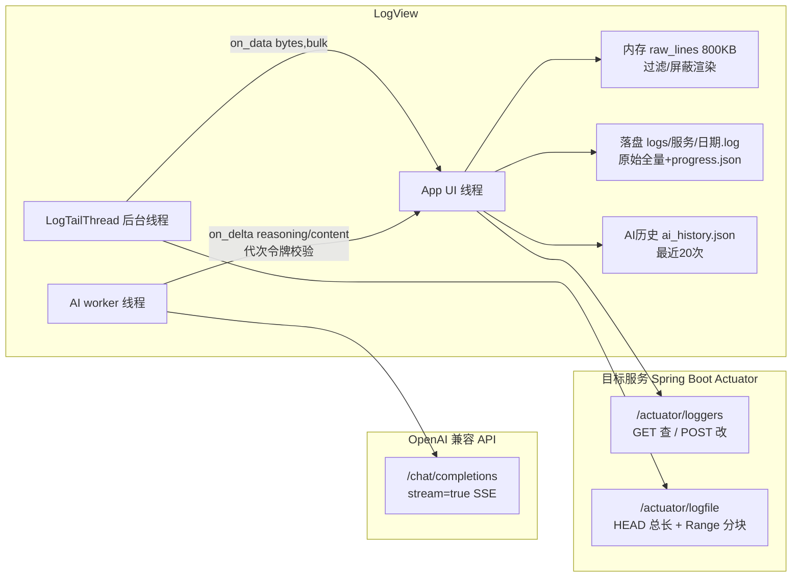

# LogView 日志查看分析工具
> 对 irfyiplatform 各服务（bs / manage / carrying）做**实时日志全量加载+跟随、AI 智能分析、免重启日志调级**的桌面运维工具，用于生产/现场问题排查。核心是实时日志与 AI 分析（默认页签），调级为辅助功能（第二页签）。

> 本文档面向 **AI 接手迭代**：动代码前先读「架构总览 / 代码地图 / 改码铁律」；「迭代决策表」记录关键设计的 why，改相关模块前必读。

## 技术栈与版本
- Python 3.12.8 64位（`D:\dev\env\Python312`，venv 内置于本目录 `.venv`；系统默认 python 是 3.14 **32位**装不了科学计算包，禁用）
- **纯标准库**（tkinter / urllib / json / threading / difflib / socket），无运行时第三方依赖
- 打包：PyInstaller 6.21.0（onefile + console=False，见下）

## 目录结构
```
日志查看分析工具/            # 2026-08-25 由「日志调级工具」更名
├─ app.py                   # 全部源码（~1950 行：HTTP 层 + tail 线程 + tkinter UI），见下方代码地图
├─ data/                    # 运行时数据（frozen 模式下跟随 exe 所在目录）
│  ├─ services.json         # 服务清单 [{name, base}]，入库
│  ├─ prefs.json            # 屏蔽词 + AI 强度 + 历史上限MB（view_max_mb），不入库
│  ├─ ai_config.json        # AI 接口配置（provider/base_url/model/api_key），⚠含密钥不入库
│  ├─ ai_history.json       # AI 历史分析（最近20次全文），不入库
│  └─ logs/{服务}/{日期}.log # 跟随日志自动落盘（保留7天自动清理）+ progress.json 落盘进度，不入库
├─ .venv/                   # 独立虚拟环境（含 pyinstaller）
├─ requirements.txt         # 仅 pyinstaller==6.21.0（运行时零依赖）
├─ 启动.bat                 # 双击启动（pythonw 无黑窗）
├─ LogView.spec             # PyInstaller 打包配置（产物 LogView.exe）
└─ release/                 # 发布版 exe（仓库只跟踪 exe 本身，release/data/ 运行数据不入库；只留最新一版）
```

## 架构总览



三条数据通路（都遵循「外部调用三要素」：超时明确 / 不自动重试 / 异常全捕获进 UI）：

1. **日志跟随**：`LogTailThread` 2s 轮询 → HEAD 总长 → Range 分块拉取。开始跟随**从文件头全量加载**（积压>1MB 走 bulk：入缓存+落盘但不渲染，追赶完成发 `on_data(None)` 信号一次性渲染）→ 之后增量实时渲染。落盘进度持久化 `progress.json`，重开从进度续传不重复；跨天/滚动自动从头全量。
2. **AI 分析**：按强度过滤行（低档只送 ERROR/WARN 相关行+异常后堆栈前5帧）→ 128KB 字节双限 → SSE 流式 → 右栏思考/结论实时展示（80ms 攒批刷新）。**代次令牌**（`_ai_gen`）防僵尸 worker 回写。
3. **调级**：写操作前全量列表存在性校验 → POST → 自动复核（configured ≠ 所设值显式告警）。

## 代码地图（app.py，按区块，函数名定位比行号稳）

| 区块 | 位置约 | 内容 |
|---|---|---|
| 常量与策略 | 顶部 30-247 | 超时/轮询/上限常量；`AI_ANALYZE_MODES` 三档强度；`AI_PROVIDERS` 提供商预置（智谱/DeepSeek/自定义）；`build_system_prompt`（含思考中文要求+档位差异段）；`filter_lines_for_mode`（强度过滤+堆栈帧保留）；`clip_lines_by_bytes`（128KB 双限，尾部优先、巨行跳过） |
| HTTP 层 | 248-467 | `_NoRedirect`（禁重定向防 302 假成功）；`_check_framework_error`（识别 200+code≠0 框架错误体）；`http_get/http_post_level/fetch_logger/check_logger_exists`（调级+存在性校验+difflib 候选）；`head_size/range_get_span`（日志文件分块）；`chat_completions/chat_completions_stream`（AI 非流式/流式 SSE 解析）；`force_close_http_response`；`AiCancelledError` |
| 日志跟随线程 | 468-546 | `LogTailThread`：全量追赶分块 / bulk 判定 / 滚动重置为0 / 进度回调 / 416 兜底 |
| GUI 骨架 | 547-860 | `App.__init__`（状态字段集中处）；`_build_ui`（实时日志页签在前）；`_build_level_tab/_build_log_tab/_build_ai_pane`；prefs/services 读写；`run_bg`（后台线程+after 回 UI 的标准通道）；`friendly_err` |
| GUI 调级 | 853-1059 | `on_ping`（弹窗反馈）；`show_help`（使用说明弹窗）；`on_query/on_apply/on_reset`（存在性校验+复核告警）；`on_browse`（全量浏览搜索） |
| GUI 跟随与落盘 | 1060-1235 | `toggle_tail/stop_tail`（含快速重开判定）；`append_log_data`（**渲染+落盘唯一入口**，bulk 参数，None=追赶完成信号）；进度读写 `_load/_save_tail_progress`；`_log_write/_log_close`（懒开句柄，服务/日期翻转自动换文件）；`_cleanup_old_logs`（7天，启动+每日）；`show_log_history`（历史弹窗：树+过滤/排除+上限MB确认按钮） |
| GUI 渲染 | 1394-1424 | `_trim_raw/render_log_view/_view_insert`（800KB 缓存、12000 行视图保护） |
| GUI AI | 1425-1935 | 配置弹窗（提供商带入/测试连通）；`on_ai_analyze`（过滤+双限+令牌）；流式渲染 `_ai_append/_ai_flush`；取消 `_ai_cancel_current`（代次+1 立即恢复 UI）；`_ai_finish/_ai_fail`（写历史）；复制/导出/历史弹窗；`_toggle_reasoning`（思考框展开收起） |

## 改码铁律（AI 必读，违反必踩坑——全是实测教训）

**线程与 UI**
1. 所有 HTTP/耗时操作走 `run_bg`（worker 线程），回 UI 必须 `root.after`；测试时 mainloop 必须在跑（见测试方法论）
2. `append_log_data` 是渲染与落盘的**唯一**入口，改跟随逻辑不要绕开它
3. Text 控件必须显式设小请求宽（默认 80 字符 ≈600px 会把右 pane 撑爆挤压左栏按钮——已踩）

**AI 取消**
4. Windows 上 `resp.close()`/`socket.shutdown` 都**无法唤醒**阻塞中的 recv——取消靠**代次令牌**（`_ai_gen += 1` 使僵尸 worker 回写失效），不要改回 close 方案

**服务端行为（10.20 实测结论）**
5. ydcloudplus 安全层拒绝返回 **HTTP 200 + {"code":401,...}**（ServletUtils.writeJSON 不设状态码）——任何 2xx 都必须过 `_check_framework_error`
6. logback 对任意 logger 名惰性接受 POST（204 假成功且查询也通过）——写操作前必须 `check_logger_exists` 全量校验
7. POST 可能被 302 到登录页，`_NoRedirect` 已全局禁跟随，不要移除

**测试方法论（tkinter 特有坑）**
8. 异步断言用 `wait_for`（root.after 轮询 + mainloop），**不要** root.update 手工泵（worker 线程的 after 会报 "main thread is not in main loop"）
9. 测试前备份 `data/prefs.json`（及 ai_config/ai_history），结束恢复——已两次误删用户真实配置
10. `ttk.Combobox` 是 `ttk.Entry` 子类（选择器要排除）；Notebook 未选中页签内容不映射；无焦点窗口 `event_generate` 键盘事件不可靠（按钮 invoke + bind 存在性断言收口）
11. 假服务用 `ThreadingHTTPServer`（单线程版 handler 阻塞会卡 shutdown）；204 响应不要带 Content-Length 头
12. 内网可达时优先实测真服务，测试造成的级别变更必须复原

**工程纪律**
13. 改完 `git add`，**严禁主动 commit**（用户说"这一版发布"时除外=打包+commit，见 skill §6）；打包必须用 `.venv\Scripts\python.exe -m PyInstaller LogView.spec --noconfirm --clean --distpath release`（直接调 pyinstaller.exe 会因目录改名后 venv 内嵌旧路径而静默失败）；exe 验证 = Start-Process + tasklist 存活（新 exe 首启 Defender 扫描慢，勿误判）
14. `.gitignore` 不支持行内注释（`release/data/` 规则曾因行内注释整体失效，ai_config.json 差点入库）
15. 外部调用（AI/actuator）改动必须明确三要素：超时值/重试策略/兜底行为

## 当前状态：源码 ↔ release 同步性
- `release\LogView.exe` 打包于 2026-08-25 23:51（2026-09-02 自 dist\ 迁移，exe 本身未重打包），**与源码完全同步**（含改名文案）；旧 LogTuner.exe 与桌面失效快捷方式已删除
- ⚠ 目录更名后 venv 的 `Scripts\*.exe` 入口（pyinstaller 等）内嵌旧绝对路径已失效——**打包必须用** `.venv\Scripts\python.exe -m PyInstaller LogView.spec --noconfirm --clean`（`python.exe` 相对定位不受影响）；彻底修复可在新路径重建 venv

## 启动方式
- 双击 `启动.bat`；或 `.venv\Scripts\pythonw.exe app.py`；或 `release\LogView.exe`（data 与 exe 同级生效）

## 端口
无（tkinter 桌面工具，不监听端口；登记于根目录 TOOLS.md）

## 数据文件说明
- `services.json`：`[{"name": "显示名", "base": "http://host:port"}]`，工具内「＋添加/－删除」维护
- `prefs.json`：`{"block_words": [...], "ai_mode": "异常和告警", "view_max_mb": 20}`——屏蔽词/强度/历史上限
- 落盘内容为**原始全量**（不受过滤/屏蔽/bulk 影响）；屏蔽只影响显示，删屏蔽词可恢复

## 功能与目标服务
| 功能 | 说明 | 依赖端点 |
|---|---|---|
| 实时日志（默认页签） | **从文件头全量加载**+实时跟随（bulk 分块追赶）；过滤白名单+屏蔽黑名单；历史日志落盘 7 天，弹窗回看（过滤/排除/上限MB 可配默认 20，点确认生效） | `/actuator/logfile` |
| AI 分析（右栏） | 三档强度（只分析异常/异常和告警/全量分析，前两档送前过滤行+堆栈帧）；OpenAI 兼容（智谱/DeepSeek/自定义，预配置+测试连通）；思考/结论流式实时展示；取消/复制/导出/历史 20 次 | `/chat/completions` stream |
| 日志调级（第二页签） | 查/改/复原 + 存在性校验 + 复核告警；常用书签；全量浏览搜索 | `/actuator/loggers` |
| 使用说明（顶部按钮） | 目标服务接入四要素 + 配置 demo + curl 自检，可一键复制 | — |

默认服务：bs `192.168.10.20:9528`、manage `:9527`、carrying `192.168.123.162:9529`（carrying 需部署 actuator 暴露配置）。

## 已知限制
- 动态调级不持久（重启回 yaml 值，特性）
- 跟随基于 HTTP Range 轮询（2 秒粒度）非推送；日志滚动时从头全量重拉（新文件内容与落盘天然不重叠）
- AI 分析：日志明文发所配 API（含内网信息），需合规确认；分析要求快照稳定（点按时自动停止跟随）；思考展示依赖 `reasoning_content`（GLM/DeepSeek 思考系支持，普通模型只有结论区）；20MB 历史上限下筛选重渲染约 1.6s（防抖后停笔才渲一次）
- exe 分发需带同级 `data\`；`ai_config.json` 含密钥勿外发
- 换机重建 venv（`D:\dev\env\Python312\python.exe -m venv .venv`）或直接用 exe

## 迭代决策表（why 存档，改相关模块前必读）

| 日期 | 决策 | 原因 |
|---|---|---|
| 08-21 | 初始版本：调级+实时日志（尾部64KB）+屏蔽词持久化；exe 用 onefile | tkinter 小，无 Streamlit 大资源坑 |
| 08-21 | AI 分析走 SSE 流式+右栏上下布局，思考默认收起 | 实时感+省空间 |
| 08-23 | 三档强度=数据过滤+提示词差异双管齐下 | 省 token 且输出结构匹配 |
| 08-23 | 128KB 双限 + max_tokens 4096 + 堆栈前5帧 | 防超长行撑爆上下文/成本失控；at 行是定位关键 |
| 08-23 | 取消用代次令牌而非 socket 强断 | Windows 唤不醒阻塞 recv（实测） |
| 08-23 | 历史分析：取消不记、失败也记 | 取消常为误点；失败有追溯价值 |
| 08-24 | 调级三道防线：框架错误体识别+禁重定向+复核告警 | 服务端 200+code401 假成功（反编译 jar 实锤） |
| 08-24 | 写操作前全量存在性校验+difflib 候选 | logback 惰性接受任意名（10.20 实测），拼错名双重假象 |
| 08-24 | 实时日志改全量加载+bulk 分块追赶+进度持久化 | 只拉尾部 64KB 日志不全；重开不重复落盘 |
| 08-24 | dist/data/ 整目录 gitignore | ai_config.json 含 key 曾被 add -A 带入暂存区 |
| 08-24 | 历史日志 2MB→20MB 默认+弹窗可配（确认按钮） | 用户机器性能好；30万行是 Text 流畅分界；防误触 |
| 08-25 | 测试连接改弹窗反馈 | 结果醒目，不再只写操作记录 |
| 08-25 | **更名 LogTuner → LogView**（目录/spec/标题/TOOLS.md/快捷方式已同步；旧 LogTuner.exe 保留至重打包） | 功能已演化为调级+查看+AI 三合一，旧名以偏概全 |
| 08-26 | 服务清单支持「编辑」（名称/地址，预填现值，重名拦截，编辑后停跟随） | 服务迁移改 IP/端口无需删除重加；更名后历史日志目录仍按旧名存放（不迁移，历史弹窗可见） |
| 09-02 | 发布目录规范化：`dist\` → `release\`（.gitignore/README/打包命令 --distpath release 同步） | create-tool skill 新规：发布版统一 release 只留最新一版，"这一版发布"=打包+验证+commit |
